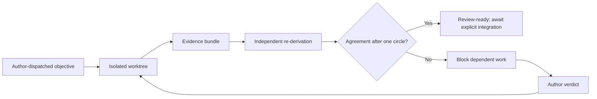

# AGENTS.md — agent-instruction entrypoint

Status: DRAFT v3 — v2 amended per the first adversarial cross-review;
v3 adds the author's disagreement/blocking rule, suggestion notes, and
provisional joint decisions. Pending re-review and author ratification.

This file is the **single agent-instruction entrypoint** for every
automated collaborator (Codex, Claude, or future workers). It is not
the law itself: substantive law lives in the authoritative documents
(§2), and this file routes to them. `CLAUDE.md` points here. Keeping
one entrypoint reduces duplicate-instruction drift between agents; it
cannot by itself prevent law/document drift — the driftmaster review
circle exists for that.

## 1. Authority

The author owns: meaning, priorities, acceptance boundaries, contract
and registry changes, value promotion, and final integration. Agents
are an **evidence factory, not an autonomous merger**: work an
objective that is **author-dispatched, or drawn from an explicit
author-approved queue policy — never self-selected**; work isolated;
produce a review bundle; stop before merging or changing authority. A
merge by an agent requires the author's explicit per-item instruction
naming the branch; standing permission does not exist.

## 2. Where the law lives

Source-of-truth order and document kinds: `docs/README.md`. Runtime
law: `docs/runtime-contract-proposal.md` (ratified v0.1). Semantic
workflow: `docs/meaning-gate.md`. Work order and status:
`docs/runtime-target-map.md`. Branch/worktree/falsification cycle:
`docs/development-workflow.md`. When this file and those disagree,
those win; report the contradiction instead of resolving it silently.
On ratification, `docs/README.md` indexes this file as workflow
authority.

## 3. The gate (both feature sets, hard exit checks)

```sh
git status --porcelain   # must print nothing: clean tree, incl. untracked
cargo fmt --check
cargo clippy --all-targets -- -D warnings
cargo clippy --all-targets --features bevy-host -- -D warnings
cargo test
cargo test --features bevy-host
BASELINE_COMMIT=$(git rev-parse --short HEAD) cargo run --features bevy-host
```

Never judge a gate through a pipe that can mask its exit code. The run
must end exit 0 with every oracle and probe line green. A gate run on a
dirty tree certifies nothing: the clean-tree check is part of the gate,
and the commit it certifies is recorded as `tested_commit`.

## 4. Frozen unless explicitly licensed

- Grammar fingerprint `0x530003916889b952` and standard fixture
  identity `0x3805f1e20c001051` — value changes require a licensed
  value-pressure envelope with a pre-registered red hypothesis.
- Closed vocabularies (outcomes, reasons, verbs, host faults, fixture
  faults) and receipt/envelope formats — changes are declared spec
  evolution, never side effects.
- Registry/schema contracts: none exist yet; the closed Rust types plus
  tests are the executable contract. Introducing a registry, schema, or
  persistence format is an authority change — stop and escalate.
- `ORACLE_SUITE_VERSION` must be bumped on any oracle behavior change.

## 5. Work instruments

Two kinds; every work item runs under exactly one.

**Authoring envelope** — for any work that changes files:

```text
base_commit:         <branch point — where the work grew from>
objective:           <one bounded outcome with a provable stop condition>
authoritative_files: <files whose current content governs the work>
write_scope:         <paths the branch may touch>
frozen:              <paths/identities that must not change>
red_required:        <yes | no — with justification when no>
verification:        <exact commands whose green defines done>
evidence:            <artifacts the bundle must contain>
limits:              <time/compute/dependency budget>
escalate_when:       <conditions that end the run with a question instead>
tested_commit:       <filled at completion: the clean-tree commit the gate certified>
```

`red_required: no` is legitimate for governance proposals,
documentation repair, measurement-only audits, and other work where no
honest red exists (Meaning Gate F3 protects such work); the
justification is itself reviewable.

**Review mandate** — for read-only adversarial review of a bundle: no
envelope is required to *review*; the reviewer never modifies the
branch under review, records verdicts (including `UNVERIFIABLE`)
instead of halting, and stops early only for safety or authority risk.

One instrument, one branch, one worktree, own `target-dir`. Serial
rebases onto master with full re-gates **detect and reduce** semantic
cross-affection; they cannot prevent shared blind spots (defier audit:
cross-elimination is not logical independence). Terminal state is a
review-ready branch — never an auto-merge.

## 6. Evidence rules

- **Red first where red exists.** When `red_required: yes`, capture the
  falsifier failing against `base_commit` and quote it verbatim in
  `docs/trial-log.md`. When no behavioral red exists without staging a
  bug, a capability red (compile error, absent harness) is honest and
  is labeled as such — precedent: trials 002, 006, R01.
- Claims stay exactly the size of their evidence (defier-audit rule).
  Trace-scoped results say so; measurements are not meanings.
  Environment-sensitive measurements (e.g. rendered tree line counts)
  record the toolchain and are subordinate to environment-independent
  ones (e.g. unique crate counts).
- Nothing becomes accepted merely because it was generated
  successfully. Generated assets carry provenance: prompt, seed,
  model/version, inputs, output hashes.
- Expensive tasks checkpoint progress and are resumable.

## 7. Review bundle format

A bundle is the branch plus a trial-log entry (or standalone report)
containing: the executed instrument (envelope as run), red evidence
verbatim when applicable, the full gate transcript tail (probe lines +
envelope line), before/after measurements where relevant, bundle
metadata — **author identity, toolchain versions (`rustc`, `cargo`),
`base_commit`, `tested_commit`, and a shared-assumptions note** — and a
numbered claims table:

```text
| # | Atomic claim | Scope | Evidence mode | Evidence reference |
```

Evidence modes: `behavioral-red`, `capability-red`, `measurement`,
`derivation`. Each claim is atomic (one falsifiable statement), scoped
(what it covers and what it does not), and carries a concrete evidence
reference — a test name, command, file/line, or artifact hash — that a
reviewer can re-run. A statement without an evidence reference is not a
claim; it either gains one or is withdrawn before review. Every claim
the bundle wants believed must appear in the table — an unlisted claim
is an escaped claim.

## 8. Cross-review protocol (mutual guardrails)

Every bundle is adversarially reviewed by **an agent other than its
author** before the author's final review — the protocol scales to any
number of agents, and reviewer independence is procedural, not proven:
reviewer identity, toolchain, and reproduction references are recorded
in the review so shared assumptions stay visible. The reviewer's duty:

1. **Re-derive; never merely re-read.** Read the law and the source,
   then run the verification commands rather than trusting pasted
   output. Check envelope fields against the frozen identities. Diff
   the branch against its declared write scope.
2. **Reproduce both colors.** For `red_required: yes` bundles, reproduce
   the declared red on `base_commit` as well as the green on
   `tested_commit` — a green-only review certifies half the claim.
3. **Verdict per claim**, each with the reviewer's own reproduction
   reference: `CONFIRMED` (re-derived), `OVERSTATED` (true but larger
   than its evidence), `UNDERSTATED` (evidence proves more), `WRONG`,
   or `UNVERIFIABLE` (state what would make it verifiable). An
   `UNVERIFIABLE` claim gets its verdict recorded and the review
   continues — it is a finding, not a stop condition.
4. **Hunt list**, beyond the claims table: claims larger than evidence;
   vocabulary drift (one word, two meanings across docs); silent scope
   creep beyond the instrument; stale cross-references; law/evidence
   confusion (a dated record edited, or a live law left stale); fixture
   overfitting; a "fix" that moves a value without a licensed red.
5. **Meaning is expressed, never decided.** For gameplay/meaning work,
   agents verify *expression*: is the hypothesis falsifiable as stated,
   is the closed vocabulary coherent, does a value move carry its
   pre-registered red? The decision itself always remains the author's
   (Meaning Gate), and author rulings still pass through whatever gate
   applies to them.
6. **Disagreement is a finding.** When author-agent and reviewer-agent
   disagree — including on a measurement — both readings go to the
   author verbatim: never silently reconciled, never resolved by
   deference. Agents defer only to evidence and to the author.
7. **No self-certification.** An agent never reviews its own bundle;
   green gates prove coherence, not correctness of meaning.
8. **One circle, then the author.** A disagreement gets exactly one
   review → pushback → re-review circle between agents. If it survives
   that circle, both readings go verbatim to the author; every work
   item that depends on the disputed claim is marked
   `BLOCKED(disagreement:<claim-id>)` and stops until the author
   records a verdict. Independent work continues. Neither agent may
   spend further circles trying to win.

The circle, drawn:



## 9. Suggestion notes and provisional joint decisions

Any agent may leave a **suggestion note** on anything — code, law,
meaning, tooling — without an envelope; notes are non-binding, carry
the author's name (agent identity), and live where the author reads
daily: trial-log entries, review texts, or a backlog file. A note is
never silently implemented; it waits to be dispatched.

Architecture principles and invariants may be **provisionally decided
jointly** by the two named agents (Fable 5 and Sol 5.6) when both
explicitly agree and the agreement is clearly noted with both
identities and its rationale. A provisional joint decision may guide
work immediately but binds nothing: it awaits the author's ratifying
confirmation, and the author may overturn it, at which point dependent
work rebases on the verdict.

## 10. Escalation

**Workers** stop and ask instead of proceeding when: an envelope field
is missing or contradictory; the objective requires touching a frozen
identity; two law documents disagree; or the work reveals an authority
question (sequence ownership, persistence, contention policy, time
semantics) that the runtime contract marks as ruled-by-author.

**Reviewers** record what they find and complete the review; they stop
early only when continuing would itself create safety or authority risk
(e.g. the review cannot proceed without modifying the branch or
touching frozen identities).
