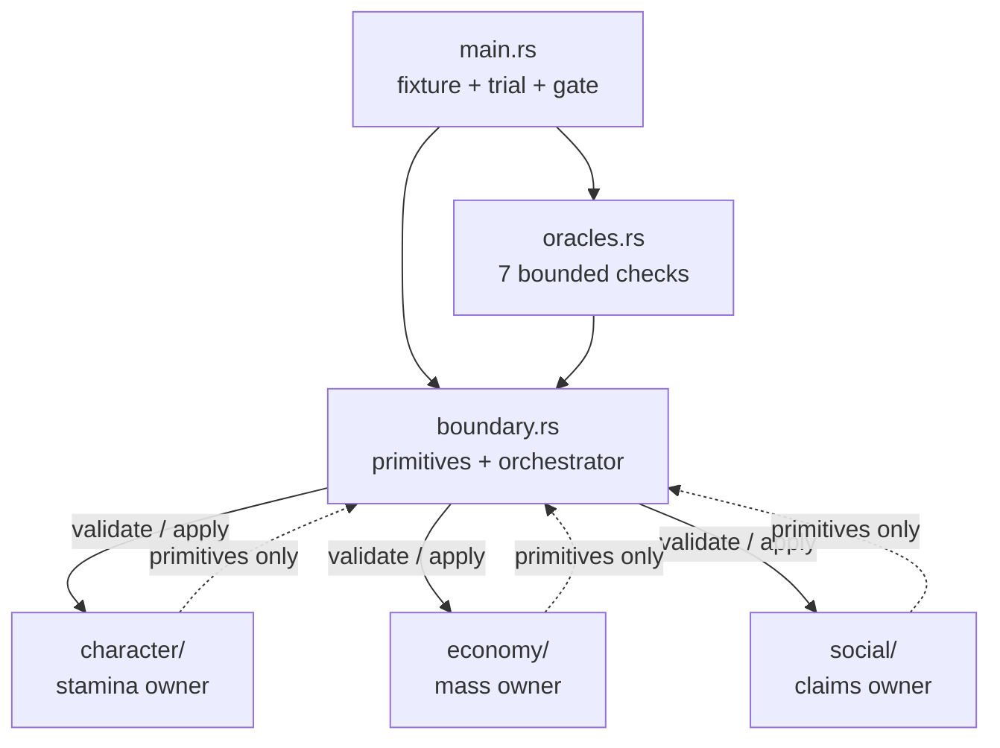
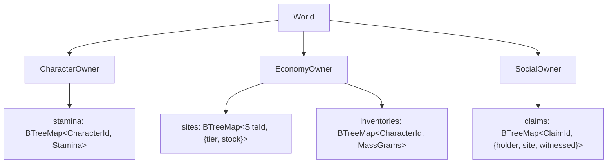
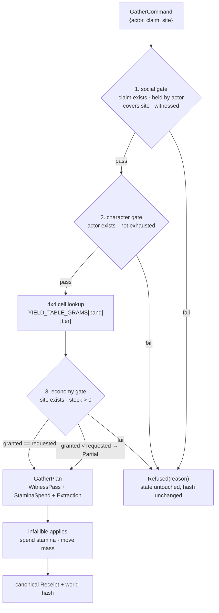
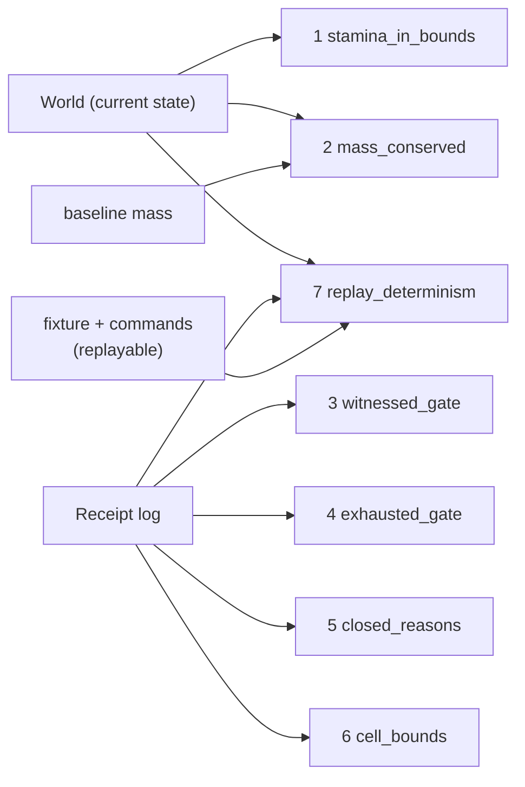

# Dependency and tool-tree map — truth-layer slice 001

Six views: the cargo tree, the module graph, the ownership tree, the flow
of one command, the oracle input map, and — for tomorrow's hypothesis
work — exactly where the tunable values live.

## 1. Cargo dependency tree

The default build is the pure boundary and has **zero external
dependencies** — `cargo tree` is one line:

```
gra-rust-bevy-spike v0.1.0
```

The `bevy-host` feature (OFF by default, host on HOLD) pulls in the full
engine — about 1,480 nodes in `cargo tree`. Depth 1–2:

```
gra-rust-bevy-spike v0.1.0
├── bevy v0.19.0
│   └── bevy_internal v0.19.0        (→ renderer, windowing, assets, …)
└── bevy_ecs v0.19.0
    ├── bevy_reflect, bevy_tasks, bevy_platform, bevy_ptr, bevy_utils
    ├── serde, thiserror, smallvec, indexmap, fixedbitset, slotmap
    └── … (proc-macros and support crates)
```

This is the concrete cost of lifting the HOLD: compile time and surface
area jump from zero to the whole engine. The truth layer itself never
references Bevy, so the boundary stays testable at zero-dependency speed
regardless.

## 2. Module graph

`boundary` defines the shared primitives (IDs, `Stamina`, `MassGrams`,
reasons, receipts, hashing) and orchestrates; each owner module depends
only on those primitives — never on another owner:



The dotted edges are the module cycle Rust allows within a crate: owners
import *types* from `boundary`, but only the orchestrator calls *into*
owners. Owners never import each other — cross-system effects can only
travel through the boundary.

## 3. Ownership tree (who may write what)



Every leaf is private to its module. The only mutation paths are
`apply_spend` (character) and `apply_extract` (economy) — both take a
proof token with private fields, so only a validation inside the same
owner can mint the right to write. Social has no apply in this slice.

## 4. Flow of one command (validate everything, then apply)



Nothing mutates until all three gates pass — a refusal at any gate leaves
the world hash byte-identical.

## 5. Oracle input map



Oracles 1–2 audit the state, 3–6 audit the receipt log, and 7 replays the
whole trial from scratch and demands identical receipts and hash. Together
they cross-check each other: a bug that forges state trips 1/2/7, a bug
that forges receipts trips 3–6.

## 6. Where the values live (for hypothesis work)

Everything tunable sits in exactly four places — change a number, run the
gate, and the receipts + oracles show the spread immediately:

| What | Where | Currently |
| --- | --- | --- |
| Yield per band × tier | `YIELD_TABLE_GRAMS` in `src/boundary.rs` | 4×4 table, 0–2700 g |
| Stamina cost per band | `STAMINA_COST_BY_BAND` in `src/boundary.rs` | `[0, 15, 12, 10]` |
| Band thresholds | `Stamina::band` in `src/boundary.rs` | 0–9 / 10–39 / 40–79 / 80–100 |
| Fixture (actors, sites, claims, commands) | `fixture()` + `commands()` in `src/main.rs` | 3 actors, 4 sites, 6 claims, 9 commands |

Suggested loop for a data-spread hypothesis: edit one table or the
fixture, run `cargo run`, read the canonical receipt lines as the
experiment record, and let the seven oracles veto any spread that breaks
an invariant. The oracle test fixture in `src/oracles.rs` is intentionally
separate and smaller, so `cargo test` keeps guarding the logic while
`main.rs` becomes the playground.

All numbers above remain mechanical examples — not balance, not
historical truth — until a hypothesis promotes them.
